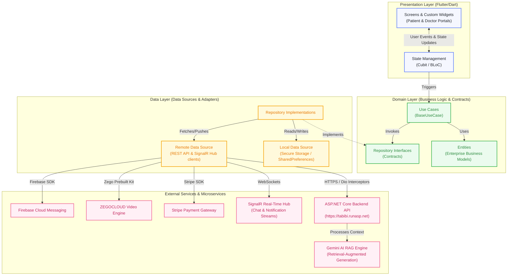
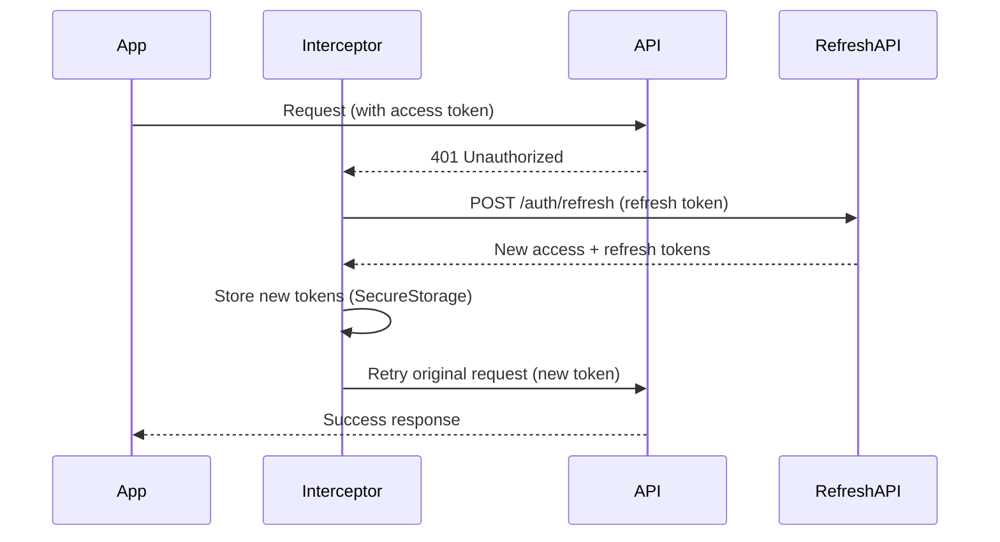
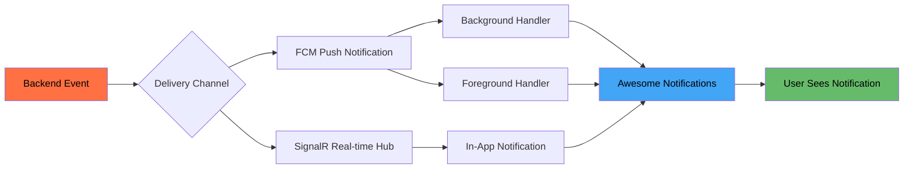

<p align="center">
  
</p>

<h1 align="center">Tabibi — طبيبي</h1>

<p align="center">
  <strong>Your Personal Healthcare Companion</strong><br/>
  A comprehensive telemedicine platform connecting patients with doctors through real-time chat, video consultations, AI-powered symptom checking, and seamless appointment booking.
</p>

<p align="center">
  <a href="#"></a>
  <a href="#"></a>
  <a href="#"></a>
  <a href="#"></a>
  <a href="#licens"></a>
  <a href="#"></a>
</p>

<p align="center">
  <a href="#-features">Features</a> •
  <a href="#-screenshots">Screenshots</a> •
  <a href="#-tech-stack">Tech Stack</a> •
  <a href="#️-architecture">Architecture</a> •
  <a href="#-getting-started">Getting Started</a> •
  <a href="#-contributing">Contributing</a>
</p>

---

## 📋 Table of Contents

- [About the Project](#-about-the-project)
- [Features](#-features)
- [Screenshots](#-screenshots)
- [Demo](#-demo)
- [Tech Stack](#-tech-stack)
- [Architecture](#️-architecture)
- [Project Structure](#-project-structure)
- [Installation](#-installation)
- [Getting Started](#-getting-started)
- [Environment Variables](#-environment-variables)
- [Configuration](#️-configuration)
- [Running the Project](#-running-the-project)
- [Building for Production](#-building-for-production)
- [Dependencies](#-dependencies)
- [State Management](#-state-management)
- [API Integration](#-api-integration)
- [Firebase & Backend Setup](#-firebase--backend-setup)
- [Testing](#-testing)
- [Performance Optimizations](#-performance-optimizations)
- [CI/CD](#-cicd)
- [Roadmap](#️-roadmap)
- [Contributing](#-contributing)
- [Known Issues](#-known-issues)
- [Future Improvements](#-future-improvements)
- [License](#-license)
- [Contact](#-contact)
- [Acknowledgements](#-acknowledgements)

---

## 📖 About the Project

**Tabibi** (طبيبي — *"My Doctor"* in Arabic) is a full-featured telemedicine mobile application built with Flutter. It serves as a dual-portal platform for both **patients** and **doctors**, enabling end-to-end healthcare delivery — from discovering nearby doctors on a live map to booking appointments, making secure Stripe payments, engaging in real-time chat via SignalR, conducting video consultations through ZEGOCLOUD, and even performing AI-powered symptom analysis.

The application is engineered with **Clean Architecture** principles and powered by the **BLoC/Cubit** state management pattern, ensuring a scalable, testable, and maintainable codebase suitable for enterprise-grade deployment.

### 🎯 Key Highlights

- **Dual-role system** — Separate, tailored experiences for patients and doctors
- **Real-time communication** — Powered by SignalR hub for instant chat & push notifications
- **AI symptom checker** — Intelligent preliminary diagnosis powered by AI
- **Live doctor map** — Google Maps integration with custom doctor markers & clustering
- **Secure payments** — Stripe integration with PCI-compliant payment sheets
- **Video consultations** — ZEGOCLOUD-powered 1-on-1 video calls
- **Dark mode support** — Full light & dark theme with system-aware switching

---

## ✨ Features

### 👤 Patient Features

| Feature | Description |
|---|---|
| **Onboarding** | Beautiful animated onboarding screens for first-time users |
| **Authentication** | Sign up, login, forgot password, email verification (OTP), and password reset |
| **Profile Management** | Complete patient profile with image upload and medical profile editing |
| **Doctor Discovery** | Browse doctors by department, search, and view detailed profiles with ratings |
| **Interactive Doctor Map** | Find nearby doctors on Google Maps with custom avatar markers and clustering |
| **Appointment Booking** | Select available time slots, book appointments, and view booking history |
| **Secure Payments** | Pay for consultations via Stripe payment sheet integration |
| **Real-time Chat** | Instant messaging with doctors through SignalR-powered live chat |
| **Video Calls** | 1-on-1 video consultations with doctors via ZEGOCLOUD |
| **AI Symptom Checker** | AI-powered symptom analysis for preliminary health assessment |
| **Medical History Logging** | Secure recording and editing of personal medical history (chronic diseases, medications, allergies, surgeries, weight, height) |
| **AI Consultation RAG** | Advanced Retrieval-Augmented Generation (RAG) system powered by Google Gemini AI, analyzing patient symptoms in the context of their medical history |
| **Favorites** | Save and manage favorite doctors for quick access |
| **Notifications** | Push notifications (FCM) + real-time in-app notifications via SignalR |
| **Prescriptions** | View prescriptions issued by doctors for completed appointments |
| **Reviews & Ratings** | Rate and review doctors after completed consultations |
| **Dark Mode** | System-aware theming with light and dark modes |

### 🩺 Doctor Features

| Feature | Description |
|---|---|
| **Doctor Dashboard** | Overview of appointments, patients, earnings, and daily statistics |
| **Schedule Management** | View and manage weekly/daily appointment schedules |
| **Availability Settings** | Set and update available time slots for patient bookings |
| **Appointment Management** | Accept, view, and track patient appointment requests |
| **Patient Requests** | Review and respond to incoming booking requests |
| **Earnings & Analytics** | Track revenue with summary views and analytics charts (fl_chart) |
| **Transaction History** | Detailed breakdown of all completed payment transactions |
| **Prescription Creation** | Write and issue digital prescriptions to patients |
| **Reviews Dashboard** | View patient reviews and ratings |
| **Doctor Chat** | Real-time messaging with patients |
| **Medical History Review** | Direct visibility into the patient's recorded medical history (allergies, chronic diseases, past surgeries) to support diagnostic decisions |
| **Profile Management** | Update professional profile, credentials, and clinic location |
| **Doctor Status Flow** | Application review pipeline — pending, approved, or rejected status handling |

---

## 📸 Screenshots

<p align="center">
  <i>Screenshots coming soon — contribute by adding them to <code>screenshots/</code></i>
</p>

<details>
<summary><b>🖼️ Click to view screenshot placeholders</b></summary>

| Screen | Light Mode | Dark Mode |
|---|---|---|
| Onboarding |  |  |
| Login |  |  |
| Patient Home |  |  |
| Doctor Map |  |  |
| Booking |  |  |
| Chat |  |  |
| Doctor Dashboard |  |  |
| AI Symptom Checker |  |  |

</details>

---

## 🎬 Demo

<p align="center">
  <i>🎥 Demo video / GIF coming soon</i>
</p>

<!--
<p align="center">
  
</p>
-->

> To add a demo, record a screen walkthrough and place the file at `screenshots/demo.gif` or link to a YouTube video.

---

## 🛠 Tech Stack

| Category | Technology |
|---|---|
| **Framework** | Flutter 3.29+ / Dart 3.9+ |
| **State Management** | flutter_bloc (Cubit pattern) |
| **Architecture** | Clean Architecture with MVVM-like presentation |
| **Dependency Injection** | get_it (Service Locator) |
| **Networking** | Dio with custom interceptors + JWT token refresh |
| **Real-time** | SignalR (signalr_netcore) for chat & notifications |
| **Video Calls** | ZEGOCLOUD (zego_uikit_prebuilt_call) |
| **Payments** | Stripe (flutter_stripe) |
| **Maps** | Google Maps Flutter with custom markers & clustering |
| **Push Notifications** | Firebase Cloud Messaging (FCM) + Awesome Notifications |
| **Authentication** | JWT (Access + Refresh tokens) with secure storage |
| **Local Storage** | flutter_secure_storage + shared_preferences |
| **Navigation** | go_router (declarative routing) |
| **Charts** | fl_chart |
| **Image Handling** | cached_network_image, image_picker, flutter_svg |
| **Responsive UI** | flutter_screenutil |
| **Theming** | Custom light/dark themes with Google Fonts |
| **Environment** | flutter_dotenv for secure env variable management |
| **Functional Programming** | dartz (Either type for error handling) |
| **Backend** | ASP.NET Core REST API (hosted at `tabibi.runasp.net`) |

---

## 🏗️ Architecture

Tabibi follows **Clean Architecture** principles organized into three distinct layers, ensuring separation of concerns and high testability:

```
┌─────────────────────────────────────────────────────┐
│                  Presentation Layer                  │
│          (Screens, Widgets, Cubits/BLoC)            │
├─────────────────────────────────────────────────────┤
│                    Domain Layer                      │
│          (Entities, Use Cases, Repositories)         │
│                   [Abstract Contracts]               │
├─────────────────────────────────────────────────────┤
│                     Data Layer                       │
│    (Models, Data Sources, Repository Impl, API)     │
└─────────────────────────────────────────────────────┘
```



### Layer Responsibilities

| Layer | Responsibility | Key Classes |
|---|---|---|
| **Presentation** | UI rendering, user interaction, state management | Screens, Widgets, Cubits |
| **Domain** | Business logic, contracts, entities | `BaseUseCase`, Entities, Repository interfaces |
| **Data** | API communication, data transformation, caching | Data Sources, Models, Repository implementations |
| **Core** | Shared utilities, DI, networking, theming, services | `ServiceLocator`, `DioInterceptors`, `AppTheme` |

---

## 📂 Project Structure

```
lib/
├── main.dart                          # App entry point
├── firebase_options.dart              # Firebase configuration (auto-generated)
│
├── core/                              # Shared application-wide code
│   ├── DI/
│   │   └── service_locator.dart       # get_it dependency injection setup
│   ├── error/
│   │   ├── exceptions.dart            # Custom exception classes
│   │   └── failure.dart               # Failure types + Dio error handling
│   ├── network/
│   │   ├── api_constance.dart         # API endpoints & keys
│   │   ├── dio_interceptors.dart      # Auth interceptor with token refresh
│   │   ├── error_message_model.dart   # Error response model
│   │   └── server_connection.dart     # SignalR hub connection (Singleton)
│   ├── routing/
│   │   ├── app_router.dart            # go_router configuration
│   │   ├── app_routes.dart            # Route constants
│   │   └── fade_slide_page_route.dart # Custom page transition animations
│   ├── services/
│   │   ├── cache_helper.dart          # Secure storage wrapper
│   │   ├── colors.dart                # Color constants
│   │   ├── location_services.dart     # GPS + custom map markers
│   │   ├── notification_manager.dart  # FCM + SignalR notification handling
│   │   ├── payment_manager.dart       # Stripe payment sheet manager
│   │   └── shared_prefs_service.dart  # SharedPreferences wrapper
│   ├── style/
│   │   └── spacing/                   # Spacing constants
│   ├── usecase/
│   │   └── base_use_case.dart         # Abstract UseCase<T, Params>
│   ├── utils/
│   │   ├── constants/                 # App-wide constants & colors
│   │   ├── enums/                     # Enumerations
│   │   ├── extensions/                # Dart extensions
│   │   ├── formatters.dart/           # Data formatters
│   │   ├── functions/                 # Utility functions
│   │   ├── helper/                    # Helper classes
│   │   ├── logging/                   # Logging utilities
│   │   ├── theme/
│   │   │   ├── theme.dart             # AppTheme (light + dark)
│   │   │   └── custom_themes/         # AppBar, Button, Text, TextField themes
│   │   └── validators/               # Form validators
│   └── widgets/                       # Shared reusable widgets
│       ├── arrow_back.dart
│       ├── confirmation_dialog.dart
│       ├── custom_input_field.dart
│       ├── drop_menu/
│       ├── premium_animated_button.dart
│       ├── primary_button.dart
│       └── success_dialog.dart
│
├── features/                          # Feature modules (Clean Architecture)
│   ├── ai_symptom_checker/            # 🤖 AI-powered symptom analysis
│   │   ├── data/
│   │   ├── domain/
│   │   └── presentation/
│   │
│   ├── authentication/                # 🔐 Auth (Login, Signup, OTP, Reset)
│   │   ├── data/
│   │   │   ├── datasources/
│   │   │   ├── models/
│   │   │   └── repositories/
│   │   ├── domain/
│   │   │   ├── entities/
│   │   │   ├── repositories/
│   │   │   └── usecases/
│   │   └── modules/
│   │       ├── login/
│   │       ├── signup/
│   │       ├── forgot_password/
│   │       ├── verify_code/
│   │       ├── create_new_password/
│   │       ├── fill_profile/
│   │       ├── doctor_fill_profile/
│   │       └── widgets/
│   │
│   ├── booking/                       # 📅 Appointment booking & management
│   │   ├── data/
│   │   ├── domain/
│   │   └── presentation/
│   │
│   ├── chat_patient/                  # 💬 Patient-side real-time chat
│   │   ├── data/
│   │   ├── domain/
│   │   └── presentation/
│   │
│   ├── doctor/                        # 🩺 Doctor portal (multi-module)
│   │   ├── appointments/              #   └── Appointment management
│   │   ├── availability/              #   └── Time slot settings
│   │   ├── chat/                      #   └── Doctor-side chat
│   │   ├── dashboard/                 #   └── Overview & statistics
│   │   ├── earnings/                  #   └── Revenue & analytics
│   │   ├── patients/                  #   └── Patient management
│   │   ├── prescription/              #   └── Digital prescription creation
│   │   ├── profile/                   #   └── Professional profile
│   │   ├── requests/                  #   └── Booking request handling
│   │   ├── reviews/                   #   └── Patient reviews
│   │   └── schedule/                  #   └── Schedule management
│   │
│   ├── doctor_details/                # 📋 Doctor profile detail view
│   │   ├── data/
│   │   ├── domain/
│   │   └── presentation/
│   │
│   ├── doctor_profile/                # 👨‍⚕️ Doctor public profile
│   │   ├── data/
│   │   ├── domain/
│   │   └── presentation/
│   │
│   ├── doctors_map/                   # 🗺️ Google Maps doctor finder
│   │   ├── data/
│   │   ├── domain/
│   │   ├── presentation/
│   │   └── utils/
│   │
│   ├── favorite/                      # ❤️ Favorite doctors
│   │   ├── data/
│   │   ├── domain/
│   │   └── presentation/
│   │
│   ├── home/                          # 🏠 Home (Patient & Doctor)
│   │   ├── data/
│   │   ├── domain/
│   │   └── presentation/
│   │       └── screen/
│   │           ├── patient/
│   │           └── doctor/
│   │
│   ├── notifications/                 # 🔔 Push & in-app notifications
│   │   ├── data/
│   │   ├── domain/
│   │   └── presentation/
│   │
│   ├── onboarding/                    # 🎉 First-run onboarding
│   │   └── presentation/
│   │
│   ├── patient_profile/               # 👤 Patient profile & medical info
│   │   └── presentation/
│   │
│   └── video_call/                    # 📹 ZEGOCLOUD video consultations
│       ├── data/
│       ├── domain/
│       └── presentation/
│
assets/
├── images/                            # App images & illustrations
└── logo/                              # App logo assets
```

---

## 💻 Installation

### Prerequisites

Ensure you have the following installed:

| Tool | Minimum Version | Download |
|---|---|---|
| Flutter SDK | 3.29+ | [flutter.dev](https://flutter.dev/docs/get-started/install) |
| Dart SDK | 3.9+ | Bundled with Flutter |
| Android Studio | Latest | [developer.android.com](https://developer.android.com/studio) |
| Xcode *(macOS only)* | 15+ | App Store |
| Git | Latest | [git-scm.com](https://git-scm.com/) |

### Clone the Repository

```bash
git clone https://github.com/iahmedmostafa/Tabibi.git
cd Tabibi
```

### Install Dependencies

```bash
flutter pub get
```

---

## 🚀 Getting Started

### 1. Set Up Environment Variables

Create a `.env` file in the project root:

```env
STRIPE_PUBLISHABLE_KEY=your_stripe_publishable_key_here
```

### 2. Configure Firebase

The project uses Firebase for push notifications. Firebase configuration is already included via `firebase_options.dart`. To set up your own Firebase project:

```bash
# Install FlutterFire CLI
dart pub global activate flutterfire_cli

# Configure Firebase
flutterfire configure --project=your-firebase-project-id
```

### 3. Set Up Google Maps

Add your Google Maps API key to the platform-specific configuration:

**Android** — `android/app/src/main/AndroidManifest.xml`:
```xml
<meta-data
    android:name="com.google.android.geo.API_KEY"
    android:value="YOUR_GOOGLE_MAPS_API_KEY"/>
```

**iOS** — `ios/Runner/AppDelegate.swift`:
```swift
GMSServices.provideAPIKey("YOUR_GOOGLE_MAPS_API_KEY")
```

### 4. Run the App

```bash
flutter run
```

---

## 🔐 Environment Variables

| Variable | Description | Required |
|---|---|---|
| `STRIPE_PUBLISHABLE_KEY` | Stripe publishable key for payment processing | ✅ Yes |

Environment variables are loaded securely at runtime using `flutter_dotenv` and accessed via the `ApiKeys` class.

> ⚠️ **Security**: Never commit your `.env` file to version control. Ensure it is listed in `.gitignore`.

---

## ⚙️ Configuration

### API Configuration

All API endpoints are centralized in [`lib/core/network/api_constance.dart`](lib/core/network/api_constance.dart):

```dart
class ApiConstance {
  static const String baseUrl = "https://tabibi.runasp.net/";
  static const String serverUrl = "https://tabibi.runasp.net/hub"; // SignalR
  // ... all endpoints
}
```

### Theme Configuration

The app supports light and dark themes configured in [`lib/core/utils/theme/theme.dart`](lib/core/utils/theme/theme.dart). The `ThemeMode.system` setting automatically follows the device's appearance preference.

### Screen Responsiveness

The app is designed for a `390 × 844` base design, scaled responsively across devices using `flutter_screenutil`.

---

## ▶️ Running the Project

```bash
# Run in debug mode
flutter run

# Run on a specific device
flutter run -d <device_id>

# Run in release mode
flutter run --release

# List available devices
flutter devices
```

---

## 📦 Building for Production

### Android

```bash
# Build APK (universal)
flutter build apk --release

# Build APK per ABI (recommended for smaller file size)
flutter build apk --split-per-abi --release

# Build App Bundle (for Google Play Store)
flutter build appbundle --release
```

### iOS

```bash
# Build for iOS
flutter build ios --release

# Build IPA for App Store submission
flutter build ipa --release
```

> **Note**: iOS builds require macOS with Xcode installed and valid Apple Developer certificates.

### Generate Native Splash Screen

```bash
dart run flutter_native_splash:create
```

---

## 📚 Dependencies

### Core Dependencies

| Package | Purpose |
|---|---|
| `flutter_bloc` | State management (Cubit pattern) |
| `get_it` | Dependency injection (Service Locator) |
| `go_router` | Declarative navigation & routing |
| `dio` | HTTP client with interceptor support |
| `dartz` | Functional programming (`Either` type) |
| `equatable` | Value equality for entities & states |

### Firebase & Backend

| Package | Purpose |
|---|---|
| `firebase_core` | Firebase initialization |
| `firebase_messaging` | Push notifications (FCM) |
| `signalr_netcore` | Real-time SignalR hub connection |

### UI & UX

| Package | Purpose |
|---|---|
| `flutter_screenutil` | Responsive screen adaptation |
| `google_fonts` | Custom typography |
| `flutter_svg` | SVG rendering |
| `cached_network_image` | Network image caching |
| `carousel_slider` | Image carousels |
| `smooth_page_indicator` | Page indicators |
| `dots_indicator` | Step indicators |
| `fl_chart` | Charts & analytics |
| `skeletonizer` | Skeleton loading placeholders |
| `flutter_staggered_animations` | Staggered list animations |
| `iconsax` | Modern icon pack |
| `easy_date_timeline` | Date timeline picker |
| `bottom_picker` | Date/time bottom sheet picker |

### Payments & Security

| Package | Purpose |
|---|---|
| `flutter_stripe` | Stripe payment integration |
| `flutter_secure_storage` | Encrypted secure storage |
| `jwt_decoder` | JWT token decoding |
| `flutter_dotenv` | Environment variable management |

### Communication

| Package | Purpose |
|---|---|
| `zego_uikit_prebuilt_call` | ZEGOCLOUD video calling |
| `image_picker` | Camera & gallery image selection |
| `url_launcher` | External URL/phone launching |

### Location & Maps

| Package | Purpose |
|---|---|
| `google_maps_flutter` | Google Maps integration |
| `location` | GPS location services |

### Notifications

| Package | Purpose |
|---|---|
| `awesome_notifications` | Rich local notifications |
| `firebase_messaging` | FCM push notifications |

### Dev Dependencies

| Package | Purpose |
|---|---|
| `flutter_lints` | Lint rules for code quality |
| `flutter_native_splash` | Native splash screen generation |
| `flutter_test` | Widget & unit testing |

---

## 🔄 State Management

Tabibi uses **flutter_bloc** with the **Cubit** pattern for state management:

```
User Interaction → Cubit Method → Use Case → Repository → Data Source → API
                                                  ↓
                              State Emission ← Either<Failure, Success>
```

### Pattern Overview

```dart
// Cubit: Manages state for a specific feature
class MyBookingsCubit extends Cubit<MyBookingsState> {
  final GetMyBookingsUseCase _useCase;
  
  Future<void> getBookings() async {
    emit(MyBookingsLoading());
    final result = await _useCase(NoParameters());
    result.fold(
      (failure) => emit(MyBookingsError(failure.message)),
      (bookings) => emit(MyBookingsLoaded(bookings)),
    );
  }
}
```

### Key Cubits

| Cubit | Feature |
|---|---|
| `LogInCubit` | User authentication |
| `SignUpCubit` | User registration |
| `DashboardCubit` | Doctor dashboard data |
| `MyBookingsCubit` | Patient booking management |
| `AppointmentCubit` | Appointment slot selection |
| `ScheduleCubit` | Doctor schedule management |
| `EarningsCubit` | Doctor earnings analytics |
| `NotificationsCubit` | Notification management |
| `RequestsCubit` | Doctor booking requests |
| `CreatePrescriptionCubit` | Prescription creation |

---

## 🌐 API Integration

### Backend

The app communicates with an **ASP.NET Core** REST API hosted at `https://tabibi.runasp.net/`.

### Networking Layer

- **Dio** handles all HTTP requests with custom interceptors
- **JWT Authentication** with automatic access token refresh on 401 responses
- **SignalR** provides real-time communication for chat messages and notifications

### Token Refresh Flow



### Error Handling

All API errors are transformed through a unified pipeline:

```
DioException → handleDioException() → ServerException → ServerFailure → UI Error State
```

The `Either<Failure, T>` type from `dartz` ensures errors are handled functionally without uncaught exceptions.

---

## 🔥 Firebase & Backend Setup

### Firebase Services Used

| Service | Purpose |
|---|---|
| **Firebase Core** | Firebase initialization |
| **Cloud Messaging (FCM)** | Push notifications to devices |

### Firebase Configuration

The Firebase project ID is `tabibi-app-23db9` with platform configurations for both Android and iOS:

```
Android App ID: 1:733019589758:android:25f62a42b8c998d1de9c2f
iOS App ID:     1:733019589758:ios:948e2b8c3095f497de9c2f
```

### Notification Architecture



The app supports notifications in all states:
- **Foreground**: Intercepted and displayed as local notifications
- **Background**: Handled by `firebaseBackgroundHandler`
- **Terminated**: Handled on app launch via `getInitialMessage()`

---

## 🧪 Testing

```bash
# Run all tests
flutter test

# Run tests with coverage
flutter test --coverage

# Run a specific test file
flutter test test/widget_test.dart
```

### Test Structure

```
test/
├── core/              # Core utilities tests
└── widget_test.dart   # Widget tests
```

> **Contribution Opportunity**: The project welcomes contributions for expanded unit, widget, and integration tests. See [Contributing](#-contributing).

---

## ⚡ Performance Optimizations

| Optimization | Implementation |
|---|---|
| **Image Caching** | `cached_network_image` for efficient network image loading & caching |
| **Skeleton Loading** | `skeletonizer` for smooth loading states instead of spinners |
| **Lazy DI** | `get_it` lazy singleton registration to defer initialization |
| **Secure Token Storage** | `flutter_secure_storage` with platform-encrypted storage |
| **SignalR Singleton** | Single persistent connection for real-time features |
| **Custom Map Markers** | Pre-rendered composite markers with avatar caching |
| **Cluster Rendering** | Canvas-drawn cluster markers to reduce map overhead |
| **Responsive Sizing** | `flutter_screenutil` prevents expensive layout recalculations |
| **Const Constructors** | Enforced via lint rules to minimize widget rebuilds |
| **Staggered Animations** | `flutter_staggered_animations` for smooth list rendering |

---

## 🔁 CI/CD

> CI/CD pipeline is not yet configured. The recommended setup:

```yaml
# Example GitHub Actions workflow (.github/workflows/ci.yml)
name: CI

on: [push, pull_request]

jobs:
  build:
    runs-on: ubuntu-latest
    steps:
      - uses: actions/checkout@v4
      - uses: subosito/flutter-action@v2
        with:
          flutter-version: '3.29.0'
      - run: flutter pub get
      - run: flutter analyze
      - run: flutter test
      - run: flutter build apk --release
```

---

## 🗺️ Roadmap

- [x] Patient authentication (signup, login, OTP verification)
- [x] Doctor authentication with status approval flow
- [x] Doctor discovery with search & departments
- [x] Interactive Google Maps doctor finder
- [x] Appointment booking with time slot selection
- [x] Stripe payment integration
- [x] Real-time chat (SignalR)
- [x] Video consultations (ZEGOCLOUD)
- [x] AI symptom checker
- [x] Push notifications (FCM + SignalR)
- [x] Doctor dashboard with earnings analytics
- [x] Prescription management
- [x] Favorites system
- [x] Dark mode support
- [ ] Multi-language support (i18n)
- [ ] Appointment reminders & calendar sync
- [ ] Medical records & document upload
- [ ] In-app rating & feedback system improvements
- [ ] Comprehensive test coverage
- [ ] CI/CD pipeline

---

## 🤝 Contributing

Contributions are welcome and appreciated! Here's how to get started:

### Getting Started

1. **Fork** the repository
2. **Clone** your fork:
   ```bash
   git clone https://github.com/your-username/Tabibi.git
   ```
3. **Create** a feature branch:
   ```bash
   git checkout -b feature/amazing-feature
   ```
4. **Commit** your changes:
   ```bash
   git commit -m "feat: add amazing feature"
   ```
5. **Push** to your branch:
   ```bash
   git push origin feature/amazing-feature
   ```
6. **Open** a Pull Request

### Commit Convention

This project follows [Conventional Commits](https://www.conventionalcommits.org/):

| Prefix | Description |
|---|---|
| `feat:` | New feature |
| `fix:` | Bug fix |
| `docs:` | Documentation changes |
| `style:` | Code formatting (no logic change) |
| `refactor:` | Code restructuring |
| `test:` | Adding/updating tests |
| `chore:` | Maintenance tasks |

### Code Guidelines

- Follow the existing Clean Architecture structure
- Use Cubit pattern for new state management
- Write meaningful commit messages
- Ensure `flutter analyze` passes with no issues
- Add tests for new features when possible

---

## ⚠️ Known Issues

| Issue | Status | Workaround |
|---|---|---|
| ZEGOCLOUD dependency override required for `zego_zim: 2.27.0` | 🟡 Active | `dependency_overrides` in `pubspec.yaml` |
| SignalR reconnection may require manual restart on poor networks | 🟡 Active | `withAutomaticReconnect()` is enabled |
| iOS builds require macOS environment | ℹ️ By Design | Use macOS or cloud CI for iOS builds |

---

## 🔮 Future Improvements

- 🌍 **Internationalization** — Arabic, English, and French language support
- 📅 **Calendar Sync** — Integration with device calendar for appointment reminders
- 📁 **Medical Records** — Upload and manage medical documents and lab results
- 🏥 **Clinic Management** — Multi-clinic support for doctors
- 📊 **Advanced Analytics** — Patient health trends and doctor performance metrics
- 🔒 **Biometric Auth** — Fingerprint and Face ID login support
- 🧪 **Full Test Suite** — Comprehensive unit, widget, and integration tests
- 🚀 **CI/CD Pipeline** — Automated build, test, and deployment workflows
- 📱 **Tablet Support** — Optimized layouts for tablet devices
- 🔔 **Smart Notifications** — AI-powered notification scheduling and prioritization

---

## 📄 License

This project is licensed under the **MIT License** — see the [LICENSE](LICENSE) file for details.

```
MIT License

Copyright (c) 2025 Ahmed Mostafa

Permission is hereby granted, free of charge, to any person obtaining a copy
of this software and associated documentation files (the "Software"), to deal
in the Software without restriction, including without limitation the rights
to use, copy, modify, merge, publish, distribute, sublicense, and/or sell
copies of the Software, and to permit persons to whom the Software is
furnished to do so, subject to the following conditions:

The above copyright notice and this permission notice shall be included in all
copies or substantial portions of the Software.

THE SOFTWARE IS PROVIDED "AS IS", WITHOUT WARRANTY OF ANY KIND, EXPRESS OR
IMPLIED, INCLUDING BUT NOT LIMITED TO THE WARRANTIES OF MERCHANTABILITY,
FITNESS FOR A PARTICULAR PURPOSE AND NONINFRINGEMENT.
```

---

## 📬 Contact

**Hamed Ahmed** — Project Maintainer

<!-- Update with your actual contact information -->
| Platform | Link |
|---|---|
| GitHub | [@HamedAhmed](https://github.com/hamed12232) |
| LinkedIn | [Connect on LinkedIn](https://www.linkedin.com/in/hamed-ahmed-1b56921a1/) |
| Email | [hamedelshafeei41@gmail.com](mailto:hamedelshafeei41@gmail.com) |

---

## 🙏 Acknowledgements

- [Flutter](https://flutter.dev/) — Google's UI toolkit for cross-platform development
- [Dart](https://dart.dev/) — The programming language powering Flutter
- [flutter_bloc](https://bloclibrary.dev/) — Predictable state management
- [Dio](https://pub.dev/packages/dio) — Powerful HTTP client for Dart
- [ZEGOCLOUD](https://www.zegocloud.com/) — Video call SDK
- [Stripe](https://stripe.com/) — Online payment processing
- [Firebase](https://firebase.google.com/) — Cloud messaging & backend services
- [SignalR](https://dotnet.microsoft.com/apps/aspnet/signalr) — Real-time web functionality
- [Google Maps Platform](https://developers.google.com/maps) — Maps & location services
- [get_it](https://pub.dev/packages/get_it) — Service locator for dependency injection
- [go_router](https://pub.dev/packages/go_router) — Declarative routing for Flutter

---

<p align="center">
  Made with ❤️ and Flutter
</p>

<p align="center">
  <a href="#tabibi--طبيبي">⬆ Back to Top</a>
</p>
